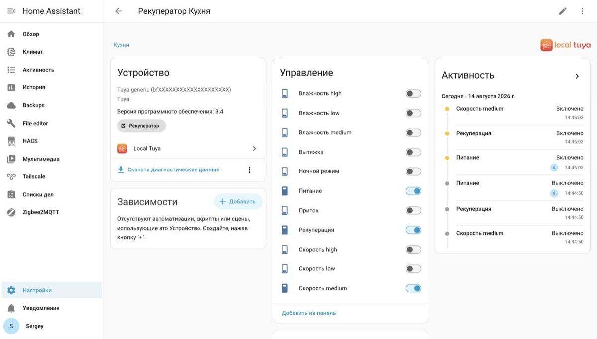
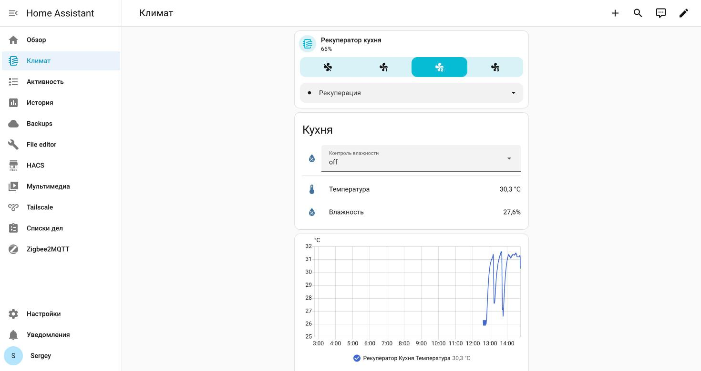

# A template `fan` on top of eleven boolean data points

[Русская версия](../ru/003-template-fan.md)

## The task

After mapping the data points ([recipe 1](001-tuya-dp-mapping.md)) Home Assistant has one entity per
point. Through LocalTuya that looks like this:

- `switch` — power
- `switch` × 3 — speeds low, medium, high
- `switch` — night mode
- `switch` × 3 — supply, exhaust, recuperation
- `switch` × 3 — humidity thresholds low, medium, high
- `sensor` × 2 — temperature and humidity



Eleven toggles work, but they're awkward to use, and more importantly neither a voice assistant nor a
decent dashboard card understands them. What you want is one `fan` with speeds and modes.

## Why a ready-made profile doesn't help

The first idea is to write a tuya-local profile, where such devices are described in a YAML file. It
doesn't work, for two reasons.

**The device's modes are separate boolean points, not an enumeration.** A `fan` entity, in tuya-local
and in templates alike, expects one point with a list of values (`low` / `medium` / `high` in a single
DP). Three independent flags don't fit that shape.

**A tuya-local profile has to be placed as a file inside the integration.** On Home Assistant OS
without a file access add-on that's a separate quest.

So: let LocalTuya provide the raw entities and build the nice layer with templates. As a bonus it's
portable — the template doesn't care which integration created the switches.

## Speeds through percentages

`fan` supports percentages, and the Home Assistant docs give the mapping for three speeds outright: 33,
66, 100. Read the current value from the three switches:

```yaml
speed_count: 3
percentage: >-
  100
  66
  33
  0
```

Note the `{%-` — it strips whitespace and the newline before the tag. Without it the template returns
`100\n` instead of `100`, and Home Assistant can't convert that to a number.

Writing is the reverse mapping:

```yaml
set_percentage:
  - choose:
      - conditions: "{{ percentage | int == 0 }}"
        sequence:
          - action: switch.turn_off
            target:
              entity_id: switch.hrv_power
      - conditions: "{{ percentage | int <= 33 }}"
        sequence:
          - action: switch.turn_on
            target:
              entity_id: switch.hrv_speed_low
      - conditions: "{{ percentage | int <= 66 }}"
        sequence:
          - action: switch.turn_on
            target:
              entity_id: switch.hrv_speed_medium
    default:
      - action: switch.turn_on
        target:
          entity_id: switch.hrv_speed_high
```

You don't need to enforce mutual exclusivity — the device clears the other speeds itself. In the UI
you'll see it one poll late: for a second or two two switches can look enabled at once.

## Modes through presets

Ventilation modes and night mode are `preset_modes`. Night goes there too rather than becoming a fourth
speed: it doesn't set the fan speed, it overrides it, and the vendor app hides the speed while it's on.

```yaml
preset_modes:
  - Supply
  - Exhaust
  - Recuperation
  - Night

preset_mode: >-
  Night
  Recuperation
  Exhaust
  Supply
  {{ none }}
```

The order of checks matters: night mode comes first because it is active together with a ventilation
mode and has to override it.

The `{{ none }}` branch is for a powered-off device: when no mode is active it's more honest to report
"unknown" than to show a mode that isn't running.

## Three workarounds for firmware quirks

This is the part you can't derive from documentation, only from observation.

### Mode won't change while power is off

The device silently ignores a mode command if power is off. So before changing a mode you have to turn
power on and give the unit a couple of seconds for its own defaults — on power-up it selects a mode and
a speed by itself.

```yaml
set_preset_mode:
  - if:
      - condition: state
        entity_id: switch.hrv_power
        state: "off"
    then:
      - action: switch.turn_on
        target:
          entity_id: switch.hrv_power
      - delay: "00:00:02"
  - choose:
      # ... branches per preset_mode
```

### Only turn power on if it's off

That `if` isn't cosmetic. On this device, writing a value that is already set **has side effects** —
that's exactly how humidity control gets cleared. What a redundant power confirmation does, I don't
know, and I'd rather not find out on live hardware.

There's a practical gain too: without the condition every mode change on a running unit would stall for
two seconds on the delay. With it, the switch is immediate.

### A point that ignores being turned off

Humidity thresholds turn on by writing `True`, but **do not turn off by writing `False`** — the device
silently ignores it. The only way to clear humidity control is to re-send the active ventilation mode.

That's why humidity is a separate `select` instead of three switches: a select has an `off` option, and
that's where the workaround goes.

```yaml
- select:
    - name: HRV humidity
      options: "{{ ['off', 'low', 'medium', 'high'] }}"
      state: >-
        high
        medium
        low
        off
      select_option:
        - choose:
            - conditions: "{{ option == 'low' }}"
              sequence:
                - action: switch.turn_on
                  target:
                    entity_id: switch.hrv_humidity_low
            # medium, high — the same
          # off: the device ignores writing False,
          # it clears when the active ventilation mode is re-sent
          default:
            - action: switch.turn_on
              target:
                entity_id: switch.hrv_recuperation
```

A subtlety: this workaround only works because the integration actually sends the command to an
already-on switch. Home Assistant doesn't suppress such calls, and LocalTuya writes the value to the
device regardless. If your integration behaves differently, you'll have to turn the mode off and back on
a second later.

And yes, humidity control on this unit is only available in recuperation mode — it's stated in the
manual, and the device switches itself to recuperation when you enable humidity. That behaviour is what
threw me off once while mapping the data points.

## How it looks



The `fan` tile: power, four speed buttons (off, low, medium, high) and a dropdown with the modes. Below
it the humidity `select` and two sensors, then twelve hours of history. The saw-tooth temperature graph
is recuperation at work: the unit keeps reversing the airflow (those are the two recuperation cycles from the
manual), so the sensor sees outside air and room air in turn.

The eleven raw LocalTuya switches are still there under the hood as a debugging screwdriver — they're
just not on the dashboard.

## How to lay out the files

Templates bloat `configuration.yaml` fast, especially with several devices.

```yaml
# configuration.yaml — entry points only
template: !include_dir_merge_list templates/
yandex_smart_home: !include yandex_smart_home.yaml
```

`!include_dir_merge_list` merges the lists from every file in the directory into one. One file per
device: `templates/hrv_kitchen.yaml`, `templates/hrv_bedroom.yaml`. Adding a third device needs no
edits to `configuration.yaml` at all.

The directory has to exist — Home Assistant won't create it. And keep stray files out of it: a file
containing only comments yields `None` instead of a list and breaks loading.

## Reloading without a restart

The `template:` section reloads on the fly:

```yaml
action: template.reload
```

There's a catch though: the `template.reload` service **does not exist** until the `template`
integration has been loaded at least once. If you've just added `template:` to the config for the first
time, you need a full Home Assistant restart — otherwise you get "unknown action". After that, reloading
works.

The complete file is in
[`examples/ventini-hrv/templates/ventini_hrv.yaml`](https://github.com/serg-kovalev/awesome-home-assistant-recipes/blob/main/examples/ventini-hrv/templates/ventini_hrv.yaml).
