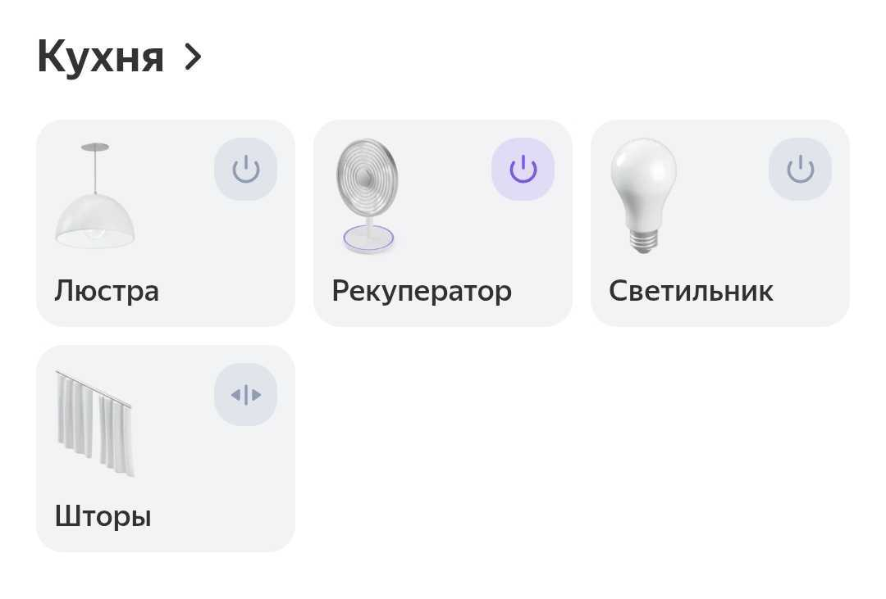
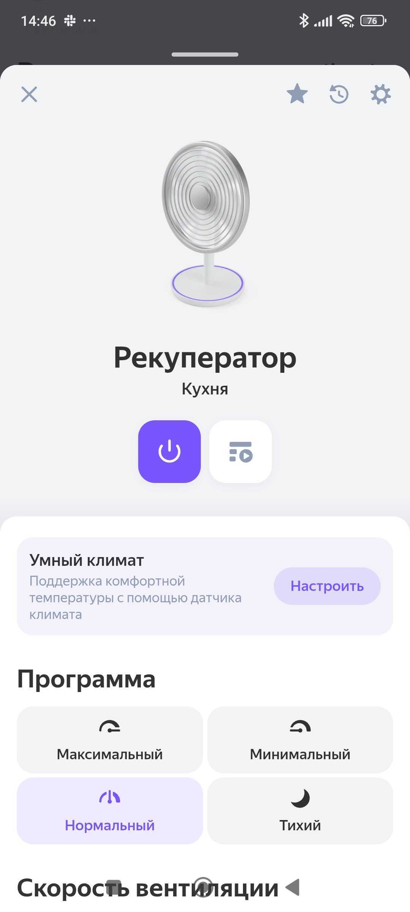
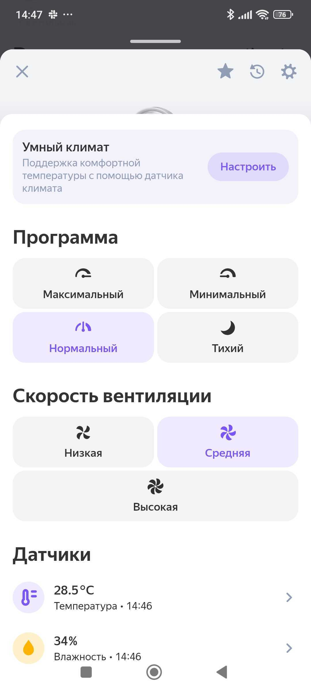

# Exporting to Yandex Smart Home

[Русская версия](../ru/004-yandex-smart-home.md)

This is about the [Yandex Smart Home](https://docs.yaha-cloud.ru) component by dext0r, which exports
Home Assistant entities to Yandex's smart home platform. Installed through HACS.

## Connection type

The component supports 3 modes. For a home with a single Home Assistant instance, **cloud** is the
one — it goes through a ready-made Yaha Cloud skill. It needs no public HTTPS address and sets up in a
minute: the wizard gives you a one-time code, you enter it in the Yandex app when adding the Yaha Cloud
manufacturer.

Direct connection makes sense if you specifically don't want an intermediate server between HA and
Yandex. The price is public HTTPS with a valid certificate and a noticeably harder setup.

Worth stating plainly: with a cloud connection your devices are visible not only to Yandex but also to
the operator of that cloud service. The component authors say so in their docs.

## Choosing entities: labels only

By default nothing is exported. The selection method is set in the integration options, and there are
several: through the UI, by entity labels, or via YAML.

Labels are the most convenient option for a home that keeps growing. You create a label (say, `Alice`)
and attach it to the entities you want. A new device shows up after you give it the same label — no
config changes.

3 things that are easy to trip over:

**Only 1 label is accepted.** The field in the integration options is not a list. If you keep semantic
groups — say `Lights` and `Fans` — and want both exported, you'll need a third, combining label and
point the filter at that. The semantic labels stay useful for automations and scripts.

**Labels on devices don't work.** Only on entities. It's stated in the docs, but easy to miss the first
time.

**A label isn't instant.** After attaching one you have to reload the integration or refresh the device
list in the app.

## What's supported and what isn't

Not everything from our unit made it across.

**`fan` is supported.** It arrives as a "Fan" device. Since our template `fan` supports percentages, the
component maps 33 / 66 / 100 onto the "fan speed" capability by itself — low, medium, high. By voice:
"turn on the fan", "set high speed".

**`select` is not supported.** It's on the unsupported list with the note "no clarity on what to do when
different values are selected". Our humidity threshold control cannot be exported.

If you really need it: expose 3 separate switches instead of the `select`, or describe a custom
capability (`custom_modes`) that calls `select.select_option`. I left humidity in Home Assistant only —
it's rarely adjusted.

## The fixed vocabulary of modes

The least obvious part. The component exports `fan` presets as the "program" capability, but **Yandex
only accepts its own fixed set of values**: `normal`, `eco`, `min`, `turbo`, `medium`, `max`, `quiet`,
`auto`, `high`. Your own names cannot go in.

If you skip the mapping, the component falls back to numbering and the app shows "One", "Two", "Three",
"Four". It works, but figuring out which is which is impossible.

The mapping lives in YAML:

```yaml
yandex_smart_home:
  entity_config:
    fan.hrv_kitchen:
      modes:
        program:
          normal: Recuperation
          quiet: Night
          max: Supply
          min: Exhaust
```

On the left is a value from Yandex's vocabulary, on the right your mode name in Home Assistant. By voice
it becomes "turn on the quiet program" instead of "turn on night mode". Clumsy, but there's no choice.

You can still put some logic into the mapping: recuperation as the main mode became "normal", night mode
really is the quiet one, supply blows at maximum, exhaust at minimum.

## When a switch beats a mode

Night mode first went across as a preset and became the "quiet program" — by the vocabulary above,
that is the only thing it could have become. By voice that meant "turn on the quiet program":
understandable, but nobody talks like that.

It also turned out not to be a ventilation mode at all, but a separate toggle
([recipe 3](003-template-fan.md)). So the same data point is now exported directly as well:

```yaml
yandex_smart_home:
  entity_config:
    switch.hrv_night:
      name: Night mode
```

It arrives as its own device and the command sounds like a command: "turn on night mode". The preset
stayed too — both read the same data point, so they cannot disagree, and there are now two phrasings
instead of one awkward one.

The general rule behind it: when a device capability doesn't fit Yandex's vocabulary, don't force it.
A switch exported on its own usually beats a mode stretched to fit.

## Sensors as device properties

If you simply label the temperature and humidity sensors, they arrive as **separate devices**. For
sensors that live inside an appliance that's awkward.

Better to attach them to the device as properties:

```yaml
yandex_smart_home:
  entity_config:
    fan.hrv_kitchen:
      properties:
        - type: temperature
          entity: sensor.hrv_temperature
        - type: humidity
          entity: sensor.hrv_humidity
```

With this approach **don't label the sensors themselves** — otherwise they arrive both as properties and
as standalone devices. The label stays on the `fan` only.

## When a full restart is required

I lost time here, so it gets its own section.

The `yandex_smart_home:` section in `configuration.yaml` is read **only at Home Assistant startup**.
Reloading the config entry (`config_entries/reload`) re-reads the cloud connection but not the YAML. The
`{"require_restart": false}` reply refers to the entry, not to your configuration, and taking it for
"everything applied" is a mistake — I made it.

So after editing `entity_config`: full HA restart, then **refresh the device list** in the app. Alice
caches a device's capability set and won't pick up new mode names on her own.

You don't need to delete the device in the app. Refreshing the list re-reads capabilities in place,
while deleting creates a device with a new internal id and detaches everything that referenced it in
scenarios.

## Order of operations when removing

If a device has to go from Yandex: first remove the label in Home Assistant, then delete the device in
the app. Not the other way around — a device left in Yandex without a backing entity in HA starts
throwing errors on state queries.

## The end result

1 fan device with these capabilities:

| Capability | What it does |
|---|---|
| On/off | power |
| Fan speed | low / medium / high |
| Program | 4 ventilation modes |
| Temperature, humidity | device properties |

Here's how it looks in the Yandex app. The unit sits in the room's device list next to the
chandelier, the lamp and the curtains — nothing suggests its manufacturer isn't supported by Home
Assistant at all:



The device card: power, fan speed and program — exactly what we described in `entity_config`:



And the control screen with speeds and the list of programs. The names come from Yandex's vocabulary
("quiet" instead of "night"), but the mapping to the unit's own modes is ours. Further down the same
screen: temperature and humidity, arriving as device properties rather than standalone sensors:



One quirk stays forever: when the unit is off, `preset_mode` is `null`, and Alice can't show "value
unknown" — she highlights the first item in the list. It looks as if a mode is selected while the device
is off. The only fix is to always return some mode, but then the UI lies in a different way.

The complete file is in
[`examples/ventini-hrv/yandex_smart_home.yaml`](https://github.com/serg-kovalev/awesome-home-assistant-recipes/blob/main/examples/ventini-hrv/yandex_smart_home.yaml).
