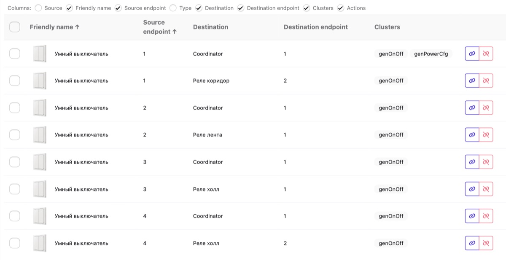

# Zigbee bindings: a wireless switch that works without the hub

[Русская версия](../ru/005-zigbee-bindings.md)

*Created: 2026-08-14*

## What this is about

A wireless Zigbee button doesn't "control" anything. It sends an event. What happens next is decided by
an automation in Home Assistant.

But there's a second path: a **binding** — a direct Zigbee-level link between the button and a relay.
The button sends its command straight to the device, bypassing the coordinator and Home Assistant.

The difference is real:

| | Automation | Binding |
|---|---|---|
| Response | via coordinator and HA | instant, direct |
| Works while HA reboots | no | yes |
| Works with the server off | no | yes |
| Conditions and logic | anything | none, just on/off |

For "the wall switch turns on the light", a binding is the better answer. Anything smarter ("dim it
after sunset") needs an automation.

The example here is the Yandex YNDX-00535, a two-gang wireless switch, in Zigbee2MQTT.

## First: where the button's events actually live

Before talking about bindings, it's worth understanding why the button looks empty in Home Assistant.

**A button creates no entities.** Zigbee2MQTT hands presses to HA as *device triggers* over MQTT
discovery, not as entities. So the device card shows a battery and nothing to configure.

In the Home Assistant automation editor the button's triggers are hidden: the "by category" tab shows
only the battery, while the presses live under **"by type" → "Other" → "Device"**. Pick the device and
you get the list of events.

**Important:** the list only contains events the device has **already sent at least once**. If the one
you need isn't there, press that key physically and reload the page. To confirm events arrive at all,
watch the Activity tab in Zigbee2MQTT or subscribe to `zigbee2mqtt/<device name>` in the MQTT
integration.

## The endpoint map

A binding needs an endpoint number, not a button name. The mapping comes from the Zigbee2MQTT converter
source in `zigbee-herdsman-converters`. For the YNDX-00535:

```js
endpoints: {b1_down: 1, b2_down: 2, b1_up: 3, b2_up: 4}
```

So a two-gang switch has 4 press targets: `b1`/`b2` are the left and right key, `up`/`down` are the
top and bottom half of each. There is no "third and fourth button".

Check this in the converter rather than guessing — the order isn't what you'd expect.

## How to create the binding

Zigbee2MQTT → device → **Bind** tab:

1. Find the right **Source endpoint** from the map above.
2. Press **+ Add** — Add, specifically. Do **not** touch the existing `Coordinator` entry: that's the
   channel your events travel to Home Assistant on. Remove it and the direct link to the relay keeps
   working, but the presses vanish from HA and you can no longer attach any automation to that button.
3. Destination is the target device. Destination endpoint is the relay channel.
4. Clusters — `genOnOff`.
5. **Bind**.

Here's the result on the **Bindings** page in Zigbee2MQTT: the button's 4 endpoints, each with its own
entry pointing at a relay, and next to it the preserved `Coordinator` entry that still carries presses to
Home Assistant:



2 pitfalls, each cost me an attempt.

**A battery device sleeps.** Binding only succeeds while the button is awake. Press Bind on a sleeping
device and you get `device/bind: Failed to bind`. The fix: start clicking the key once a second and press
Bind at that moment. Sounds silly, works reliably.

**On a two-channel relay pick the number, not the name.** The Destination endpoint list shows both
`1`/`2` and `l1`/`l2`. Choose `l2` and the cluster list stays empty ("No options") with Bind disabled.
Only the numeric variant works: `l1` = `1`, `l2` = `2`.

## Gestures and the commands they send

Each half of each key on this switch supports several gestures: a single press, a double press and a
long hold. Every gesture sends its own command, which in the log looks like different `action` values
coming from the same press target — for example `on_b2_down` and `toggle_b2_down`.

This is where I confused myself. Clicking the key rapidly to keep the device awake, I got
`on, on, toggle, on` in the log and concluded that the firmware sends different commands for the same
press. In fact some of my presses were registered as double presses — different gestures, not
randomness.

The practical takeaway: **work out which gesture sends which command first**. Press once, pause, look at
the log. The pause isn't a formality — without it you'll get double presses instead of single ones, just
as I did.

This matters for bindings too. A binding passes on whatever command the button sent: `on` turns the
relay on, `off` turns it off, `toggle` flips it. If you want one key to both switch on and off, check
that the gesture you use actually sends `toggle`.

## Does it really work without the coordinator

Yes. A binding is an entry in the button's own binding table: it sends the command straight to the relay.
Shut down Home Assistant, restart Zigbee2MQTT, pull the stick out — the button keeps clicking the relay.

3 clarifications:

**You still need a radio path.** If the button and the relay aren't in direct range, the frame is routed
through routers — mains-powered devices. Those work without the coordinator; the mesh lives on, you just
can't join new devices.

**The `Coordinator` entry isn't "via the coordinator".** It's a separate binding that carries events to
Home Assistant. That's the one we keep.

**State in HA will lag.** While the coordinator is offline HA won't learn that the relay switched — the
relay reports its state to the coordinator. The light will be on while the UI says off, until the link is
back.

## Don't keep a binding and an automation on the same button

Both will fire: the binding switches the relay, the automation switches it back. It looks exactly like
"the button doesn't work", and you can spend a long time hunting for the cause.

If you're migrating from automations to bindings, don't delete the automations — **disable** them. That
gives you a ready rollback: remove the binding with Unbind and enable the automation again.
