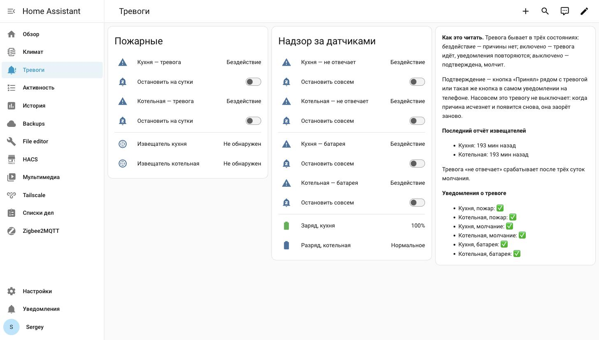

# Alerts that keep nagging until you acknowledge them

[Русская версия](../ru/006-alerts.md)

*Created: 2026-08-16*

## The task

A smoke detector trips at 4am. Home Assistant sends a notification, the phone chirps once, you sleep
through it. That's the whole alerting system, done.

What you want is different: keep repeating until a human reacts. And, separately, you want to know the
detector itself is alive — because a dead one looks exactly like a healthy one. Both are silent.

## Why you've never heard of `alert`

The `alert` integration has shipped with Home Assistant forever. It has no config flow, no "add" button,
no entry in the integrations list. YAML only, and you can only find it if you already know it exists.

Which is why the usual answer online is an automation with a `repeat` loop, an `input_boolean` to track
acknowledgement and hand-rolled interval arithmetic. `alert` does all of that in one block:

```yaml
# configuration.yaml
alert: !include alerts.yaml
```

```yaml
# alerts.yaml
smoke_kitchen:
  name: Smoke in the kitchen
  entity_id: binary_sensor.smoke_kitchen
  state: "on"
  repeat: 1
  can_acknowledge: true
  skip_first: false
  title: Fire alarm
  message: The kitchen detector went off
  done_message: Kitchen — fire alarm repeats stopped
  notifiers:
    - mobile_app_phone
```

As long as `binary_sensor.smoke_kitchen` stays `on`, the notification goes out every minute.

The important difference from "mute for an hour": `can_acknowledge` does not disarm anything. Acking
stops the repeats but leaves the alert armed — if the cause clears and comes back, it fires again. For
false trips that's exactly the behaviour you want.

## Acknowledging from the notification itself

Out of the box you acknowledge an alert by turning off its `alert.*` entity in the UI. At 4am, half
awake, hunting for an entity on your phone is not a plan.

Put the button in the notification instead:

```yaml
  data:
    actions:
      - action: ACK_smoke_kitchen
        title: Got it
```

And handle it with a single automation, for every alert you will ever add:

```yaml
triggers:
  - trigger: event
    event_type: mobile_app_notification_action
conditions:
  - condition: template
    value_template: "{{ trigger.event.data.action.startswith('ACK_') }}"
actions:
  - action: alert.turn_off
    target:
      entity_id: "{{ 'alert.' ~ trigger.event.data.action[4:] }}"
```

The trick is the naming convention: an alert's key in `alerts.yaml` *is* the entity name after
`alert.`. Name the action `ACK_<key>` and you recover the entity by dropping 4 characters. No
per-alert branches at all.

## Why the notification may not make a sound

The companion app documentation offers 3 fields:

```yaml
  data:
    ttl: 0
    priority: high
    channel: alarm_stream
```

`ttl: 0` and `priority: high` force immediate delivery, bypassing battery saving. `channel:
alarm_stream` is supposed to play the sound on the alarm stream, which in turn is supposed to ignore
silent mode.

**On our phone it never worked. Not once.** A Xiaomi on Android 14, 6 test pushes: with and without Do
Not Disturb, plain `alarm_stream` and `alarm_stream_max`, before and after deleting the notification
channel so Android would recreate it, alarm volume at maximum, ringtone explicitly selected on the
channel. The notification always arrived, vibration always fired, sound never came.

The cause is the vendor ROM: MIUI keeps its own layer above Android's notification channels and mutes
app sound in silent mode no matter what the app asks for.

What did work was speech:

```yaml
  data:
    message: TTS
    tts_text: Attention. Smoke in the kitchen
    media_stream: alarm_stream_max
    ttl: 0
    priority: high
```

The phone **speaks the text out loud** over the alarm stream. It's a different mechanism entirely, and
it goes around the channel layer where everything else got stuck.

But speech has no card in the shade and — more importantly — no "Got it" button. An alert sends the
same payload to every notifier, so voice would have displaced the acknowledgement. Hence the split:
`alert` owns the card, the text and the button; a separate automation owns waking you up.

```yaml
- alias: Fire alarm by voice
  triggers:
    - trigger: state
      entity_id:
        - alert.smoke_kitchen
        - alert.smoke_boiler
      to: "on"
  actions:
    - repeat:
        while:
          - condition: template
            value_template: "{{ is_state(trigger.entity_id, 'on') }}"
          - condition: template
            value_template: "{{ repeat.index <= 60 }}"
        sequence:
          - action: notify.mobile_app_phone
            data:
              message: TTS
              data:
                tts_text: "{{ 'Attention. ' ~ state_attr(trigger.entity_id, 'friendly_name') }}"
                media_stream: alarm_stream_max
                ttl: 0
                priority: high
          - delay: "00:01:00"
```

The loop stops itself once the alert is acknowledged or the cause clears. The cap of 60 repeats is for
when nobody is home.

### About `ttl` and `priority` in the voice notification

They're easy to forget, because `alerts.yaml` already has them and here you're writing them again. We
forgot — and got a very clear demonstration.

3 voice messages went out a minute apart, and the phone spoke all 3 back to back, in one burst. Worse:
the "all clear" message, sent **after** them, arrived **before** them, because the alert did carry those
fields. In a real fire you would have heard "alarm cleared" first and "Attention, smoke" afterwards.

Android holds messages without `ttl: 0` and `priority: high` until it next wakes up. Put them on
anything urgent.

## Making sure the detector is still alive

A detector with a dead battery, or one that quietly fell off the network, is worse than no detector at
all: it manufactures a false sense of safety.

The obvious idea is to watch for `unavailable`. With Zigbee2MQTT that doesn't work — `availability` is
off by default. Don't guess, ask the bridge itself on `zigbee2mqtt/bridge/info`:

```json
"availability": {"enabled": false, "active": {"timeout": 10}, "passive": {"timeout": 1500}}
```

Entities will never go unavailable on their own. You can enable `availability`, but it has a price:
mains devices get pinged every 10 minutes, battery devices are only marked offline after 1500 minutes —
that's 25 hours — and entities dropping to `unavailable` break conditions like "the light is off",
because `unavailable` is not `off`.

Watching the time of the last report is sturdier:

```yaml
- binary_sensor:
    - name: Kitchen detector silent
      state: >-
        {{ states.binary_sensor.smoke_kitchen is not none
           and (now() - states.binary_sensor.smoke_kitchen.last_reported).total_seconds() > 259200 }}
```

2 things matter here.

`last_reported` (added in 2024.8) is not `last_updated`. `last_updated` only moves when the state or an
attribute changes, and a smoke detector sits at `off` for years — by that measure it has been silent
since the last restart. `last_reported` moves on every report from the device, even when the value is
unchanged.

A template containing `now()` re-evaluates every minute by itself. No triggers needed.

### Take the threshold from data, not from your gut

We started with 24 hours. The number felt sensible and was pure invention.

Checking it is easy: raise the Zigbee2MQTT log level from `warning` to `info`, which logs every MQTT
publish with a timestamp. Over one night, 23:44 to 08:45, this is what came out:

- the kitchen detector — **no reports at all**
- the boiler room detector — **1 report**, at 01:27
- for scale, a climate sensor reported 82 times in the same window

Smoke detectors go quiet for hours, and that is normal for them. A 24 hour threshold would have fired a
false "detector not responding" — precisely the kind of notification that trains you to ignore your fire
alarm. We raised it to 72 hours, which is the number in the template above.

Zigbee2MQTT logs don't grow without bound: the file rotates at 10 MB, 3 files per directory, 10
directories kept. Still, put the level back to `warning` once you've taken your measurement.

## Stopping the notifications

Acknowledging stops repeats while the cause holds. Sometimes you need the other thing: silence it while
the cause is still there. Food burned, the detector is screaming, the smoke hasn't cleared yet — you
want to say "I know, be quiet for an hour".

`alert` can't do that. The mechanism is assembled from 3 parts.

**A helper holding the time until which we stay quiet** — one `input_datetime` per alert, with date and
time.

**A gate — a template binary sensor** that the alert watches instead of the detector:

```yaml
- binary_sensor:
    - name: Gate smoke kitchen
      state: >-
        {{ is_state('binary_sensor.smoke_kitchen', 'on')
           and now().timestamp() > (state_attr('input_datetime.snooze_smoke_kitchen', 'timestamp') or 0) }}
```

The gate stays shut while the helper holds a future timestamp. `now()` makes the template re-evaluate
every minute, so the gate reopens on its own when the time passes — no triggers involved.

In `alerts.yaml` you then point `entity_id` at the gate instead of the detector.

**A script that sets the time:**

```yaml
stop_alert:
  fields:
    key:
      description: Alert key
    hours:
      description: How many hours to stay quiet. 0 re-arms it
  sequence:
    - action: input_datetime.set_datetime
      target:
        entity_id: "{{ 'input_datetime.snooze_' ~ key }}"
      data:
        timestamp: "{{ now().timestamp() + (hours | float) * 3600 }}"
    - action: alert.turn_off
      target:
        entity_id: "{{ 'alert.' ~ key }}"
```

On a dashboard the nicest control for this is a toggle — a template `switch` that derives its state from
the helper:

```yaml
- switch:
    - name: Stop kitchen notifications
      state: >-
        {{ (state_attr('input_datetime.snooze_smoke_kitchen', 'timestamp') or 0) > now().timestamp() }}
      turn_on:
        - action: script.stop_alert
          data: {key: smoke_kitchen, hours: 24}
      turn_off:
        - action: script.stop_alert
          data: {key: smoke_kitchen, hours: 0}
```

The toggle stores no state of its own, so it switches itself off when the time runs out and cannot drift
out of sync with reality.



The screenshot shows the whole thing at once: fire alerts on the left, supervisory ones on the right,
a toggle under each, and in the side card — how many minutes ago each detector last reported, plus
which alerts are currently silenced.

Cap the durations by alert type: 24 hours maximum for fire, so a forgotten silence expires by itself;
supervisory alerts (low battery, detector silent) can have an "indefinitely" option — a date far in the
future. A fire alarm silenced forever is a quiet shutdown that nobody will remember.

## The trap: stopping reports a false all-clear

When you stop the notifications, the gate closes. From `alert`'s point of view that looks like the cause
disappearing — so it sends `done_message`.

Your phone gets "Kitchen — alarm cleared" while the smoke is still there and all the human did was press
"be quiet". Verified on live hardware: stopping with the detector still triggered does send the
all-clear.

Don't drop `done_message` altogether — it's genuinely useful when the smoke really clears. Make the text
true in both cases instead:

```yaml
  done_message: Kitchen — fire alarm repeats stopped
```

One thing you can't fix: the all-clear message keeps the "Got it" button. An alert sends the same set of
actions with every message it emits, and there's no supported way to strip them from the final one. It's
harmless — pressing it on an idle alert does nothing.

## Sharp edges

**No editor, no reload.** `alert` exposes `turn_on`, `turn_off` and `toggle`, nothing else. Every edit to
`alerts.yaml` needs a full core restart. Which dictates the working order: build and verify templates and
scripts first (those do reload), then change `alerts.yaml` and restart once. Do it the other way round and
a broken template leaves your alerts pointing at entities that don't exist — the alarm is dead and says
nothing about it.

**Alerts are not in the entity registry.** You won't find them under Settings → Entities: zero records in
`core.entity_registry`. Developer Tools → States only. So build a dedicated dashboard, otherwise
acknowledging and silencing is painful.

**After a core restart a detector can sit at `unknown`** until its next report. The gate is shut while
that lasts, so the alert cannot fire. For devices that report once every few hours that's a noticeable
window.

**`repeat` is in minutes.** The docs say "a number or a list of numbers" and say nothing about fractions.

## What you end up with

3 layers, each covering a different hole:

- `alert` repeats the notification until someone acknowledges it
- a separate automation speaks the alarm out loud, because the built-in sound may simply not work
- a template sensor watches the detector's own silence, with a threshold taken from measurements

Plus the stop mechanism, without which the first layer is too annoying to live with.
