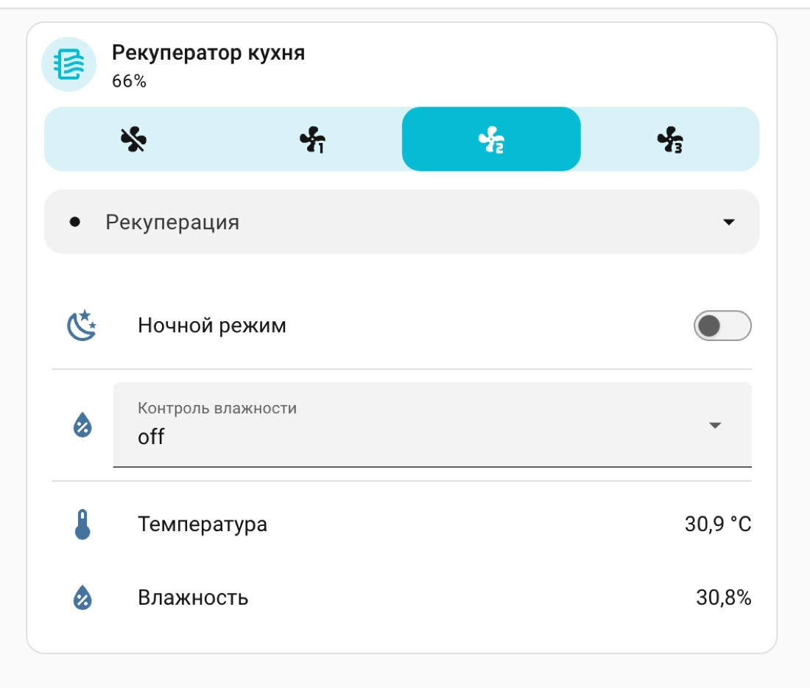

# Шаблонный `fan` поверх 11 булевых точек

[English version](../en/003-template-fan.md)

*Создано: 2026-08-14 · Обновлено: 2026-08-16*

## Задача

После разбора карты DP ([рецепт 1](001-tuya-dp-mapping.md)) в Home Assistant появились сущности —
по одной на точку данных. Через LocalTuya это выглядит так:

- `switch` — питание
- `switch` × 3 — скорости low, medium, high
- `switch` — ночной режим
- `switch` × 3 — приток, вытяжка, рекуперация
- `switch` × 3 — пороги влажности low, medium, high
- `sensor` × 2 — температура и влажность


11 тумблеров работают, но пользоваться ими неудобно, и главное — их не понимает ни голосовой
ассистент, ни нормальная карточка на дашборде. Хочется один `fan` со скоростями и режимами.

## Почему готовый профиль не спасает

Первая мысль — написать профиль для tuya-local, где такие устройства описываются YAML-файлом. Не
выходит по 2 причинам.

**Режимы у прибора — отдельные булевы точки, а не перечисление.** Сущность `fan` и в tuya-local, и в
шаблонах ожидает одну точку со списком значений (`low` / `medium` / `high` в одном DP). 3 независимых
флага в неё не ложатся.

**Профиль tuya-local надо положить файлом внутрь интеграции.** На Home Assistant OS без аддона
файлового доступа это отдельный квест.

Поэтому: сырые сущности отдаём LocalTuya, а красивую надстройку делаем шаблоном. Заодно это переносимо
— шаблон не зависит от того, какая интеграция создала переключатели.

## Скорости через проценты

`fan` умеет проценты, а документация Home Assistant прямо даёт раскладку для 3 скоростей: 33, 66,
100. Читаем текущее значение из 3 переключателей:

```yaml
speed_count: 3
percentage: >-
  100
  66
  33
  0
```

Обратите внимание на `{%-` — он срезает пробелы и перевод строки перед тегом. Без него шаблон вернёт
`100\n` вместо `100`, и Home Assistant не сможет привести значение к числу.

Запись — обратное преобразование:

```yaml
set_percentage:
  - choose:
      - conditions: "{{ percentage | int == 0 }}"
        sequence:
          - action: switch.turn_off
            target:
              entity_id: switch.hrv_power
      - conditions: "{{ percentage | int <= 33 }}"
        sequence:
          - action: switch.turn_on
            target:
              entity_id: switch.hrv_speed_low
      - conditions: "{{ percentage | int <= 66 }}"
        sequence:
          - action: switch.turn_on
            target:
              entity_id: switch.hrv_speed_medium
    default:
      - action: switch.turn_on
        target:
          entity_id: switch.hrv_speed_high
```

Взаимоисключаемость обеспечивать не нужно — прибор гасит остальные скорости сам. В интерфейсе это
видно с задержкой одного опроса: 2 переключателя на секунду-две могут выглядеть
включёнными одновременно.

## Режимы через пресеты

Режимы проветривания и ночной режим — это `preset_modes`. Ночной кладём туда же, а не четвёртой
скоростью: он не задаёт обороты, а перекрывает их, и в приложении при нём скорость просто скрывается.

```yaml
preset_modes:
  - Supply
  - Exhaust
  - Recuperation
  - Night

preset_mode: >-
  Night
  Recuperation
  Exhaust
  Supply
  {{ none }}
```

Порядок проверок важен: ночной режим идёт первым, потому что он активен одновременно с режимом
проветривания и должен его перекрывать.

Ветка `{{ none }}` нужна для выключенного прибора: когда ни один режим не активен, честнее вернуть
«неизвестно», чем показывать несуществующий режим.

## 4 обхода прошивочных странностей

Это та часть, которую невозможно вывести из документации — только из наблюдений.

### Режим не переключается при выключенном питании

Прибор молча игнорирует команду режима, если питание выключено. Значит перед сменой режима надо
включить питание и дать прибору пару секунд на его собственные дефолты — при включении он сам
выставляет режим и скорость.

```yaml
set_preset_mode:
  - if:
      - condition: state
        entity_id: switch.hrv_power
        state: "off"
    then:
      - action: switch.turn_on
        target:
          entity_id: switch.hrv_power
      - delay: "00:00:02"
  - choose:
      # ... ветки по preset_mode
```

### Включать питание только если оно выключено

Условие `if` здесь не для красоты. Повторная запись уже установленного значения у этого прибора
**имеет побочные эффекты** — именно так сбрасывается контроль влажности. Что делает повторное
подтверждение питания, я не знаю и проверять на живом железе не хочу.

Плюс практическая выгода: без условия каждая смена режима на работающем приборе тормозила бы на 2
секунды из-за задержки. С условием переключение происходит сразу.

### Точка, которая игнорирует выключение

Пороги влажности включаются записью `True`, но **не выключаются записью `False`** — прибор молча её
игнорирует. Сбросить контроль влажности можно только повторной отправкой активного режима
проветривания.

Поэтому влажность вынесена в отдельный `select`, а не в 3 переключателя: у него есть значение `off`,
которому мы даём нужный обходной сценарий.

```yaml
- select:
    - name: HRV humidity
      options: "{{ ['off', 'low', 'medium', 'high'] }}"
      state: >-
        high
        medium
        low
        off
      select_option:
        - choose:
            - conditions: "{{ option == 'low' }}"
              sequence:
                - action: switch.turn_on
                  target:
                    entity_id: switch.hrv_humidity_low
            # medium, high — так же
          # off: прибор игнорирует запись False,
          # гасится повторной отправкой активного режима проветривания
          default:
            - action: switch.turn_on
              target:
                entity_id: switch.hrv_recuperation
```

Тонкость: этот обход работает только потому, что интеграция отправляет команду на уже включённый
переключатель. Home Assistant не подавляет такие вызовы, а LocalTuya честно пишет значение в
устройство. Если ваша интеграция ведёт себя иначе, придётся выключить режим и через секунду включить.

И да, контроль влажности у этого прибора доступен только в режиме рекуперации — это написано в
инструкции, и прибор сам переключается в рекуперацию при включении влажности. Именно это поведение
однажды сбило меня с толку при разборе карты DP.

### Ночной режим оказался не режимом

Сначала я положил ночной четвёртым пресетом рядом с притоком, вытяжкой и рекуперацией: в приложении
он стоит в том же ряду, логика казалась очевидной. Ошибка вскрылась не сразу — из ночного нельзя было
выйти.

Что показали замеры на живом приборе:

- при включённом ночном **команды скорости игнорируются** — прибор их просто не принимает;
- флаги скорости и режимов проветривания при этом сброшены, горит только ночной;
- запись `False` в ночной **работает** — в отличие от порогов влажности;
- после выключения ночного прибор возвращается в то состояние, в котором был до его включения.

То есть это не четвёртое направление потока, а перехват управления. Пресет ночной включал, но ничто
его не выключало: выбираешь «Рекуперация» — она включается, ночной остаётся, а чтение состояния, где
ночной проверяется первым, продолжает показывать «Ночной». Выглядит как зависшая плитка.

Обход простой: перед сменой и режима, и скорости ночной надо погасить и дать прибору пару секунд на
его собственные дефолты.

```yaml
- if:
    - condition: template
      value_template: >-
        {{ preset_mode != 'Ночной'
           and is_state('switch.hrv_night', 'on') }}
  then:
    - action: switch.turn_off
      target:
        entity_id: switch.hrv_night
    - delay: "00:00:03"
```

Тот же блок нужен и в `set_percentage`, иначе кнопки скорости в ночном не делают ничего.

Побочный вывод оказался приятнее самой ошибки. Раз ночной — это переключатель, а не направление
потока, он и в интерфейсе должен быть переключателем: отдельная строка на дашборде рядом с
управлением влажностью. А в Умный дом Яндекса он уехал отдельным устройством, и голосом это стало
«включи ночной режим» вместо «включи тихую программу» — см. [рецепт 4](004-yandex-smart-home.md).
Пресет при этом остался: обе сущности читают одну точку данных и не расходятся.

## Как это выглядит


Этот скриншот сделан до того, как я разобрался с ночным режимом. На нём ещё есть история за 12 часов:
пилообразный график температуры — это работа рекуперации, прибор периодически переключает направление
потока (те самые 2 цикла из инструкции), и датчик видит то воздух с улицы, то из помещения. Красиво,
но в быту не нужно, поэтому графики я потом убрал. Что было сделано неправильно с ночным режимом и
почему та недоработка в итоге улучшила голосовое управление — написано выше.

Стало так:



Плитка `fan`: питание, 4 кнопки скорости (выключено, low, medium, high) и выпадающий список режимов.
Ниже — переключатель ночного режима, `select` влажности и 2 датчика.

11 сырых переключателей LocalTuya при этом никуда не делись — они остаются под капотом как отвёртка
для отладки, просто не вынесены на дашборд.

### Как собрать это в одну карточку

Плитка `fan` и список с остальными строками — разные типы карточек, поэтому штатно они всегда будут
двумя панелями с двумя рамками. `vertical-stack` ставит их друг под друга, но рамки остаются.

Единственный способ получить одну рамку — карточка `vertical-stack-in-card` из HACS
([ofekashery/vertical-stack-in-card](https://github.com/ofekashery/vertical-stack-in-card)). Меняется
ровно одна строка в конфигурации дашборда:

```yaml
type: custom:vertical-stack-in-card
cards:
  - type: tile
    entity: fan.hrv_kitchen
    features:
      - type: fan-speed
      - type: fan-preset-modes
        style: dropdown
  - type: entities
    entities:
      - entity: switch.hrv_night
        name: Ночной режим
      - type: divider
      - entity: select.hrv_humidity
      - entity: sensor.hrv_temperature
      - entity: sensor.hrv_humidity
```

Заголовок у вложенного списка стоит убрать: внутри общей рамки он выглядит лишним разделителем.

Решайте сами, стоит ли оно того. Карточка чисто косметическая, но дашборд начинает зависеть от
стороннего дополнения: удалите его — и вместо карточки будет «Custom element doesn't exist». Лечится
возвратом типа на обычный `vertical-stack`, так что риск невелик, и для домашнего дашборда это
нормальный размен.

## Второй такой же прибор

Всё выше — про надстройку над готовыми сущностями. Но сами сущности, те самые 11 переключателей и 2
датчика, заводятся в LocalTuya вручную: отдельная форма на каждую точку, в ней номер, тип и имя. На
один прибор это 13 форм. На три — 39, и к середине второго прибора вы начнёте ошибаться.

Повторять не нужно. LocalTuya умеет выгружать раскладку уже настроенного устройства в файл. В
настройках интеграции выбираете «Edit device», нужный прибор и ставите галочку экспорта конфигурации.
Файл появляется в `custom_components/localtuya/templates/` и называется по имени устройства.

Дальше при добавлении следующего прибора вместо ручной настройки выбираете «Choose template» и берёте
этот файл. Все 13 сущностей создаются разом — с теми же номерами точек, типами и именами.

Здесь придётся оговориться про слово. В этой статье «шаблон» — это шаблонный `fan`, надстройка Home
Assistant. А выгрузка выше — «шаблон» в смысле LocalTuya, файл с раскладкой точек. Две разные вещи с
одинаковым названием, и путать их дорого.

Руками остаётся немного: имя, адрес и локальный ключ нового прибора. Плюс переименование сущностей,
если хотите, чтобы в `entity_id` была комната, — экспорт переносит имена как есть, от прибора-донора.

## Как разложить файлы

Шаблоны быстро раздувают `configuration.yaml`. Особенно если приборов несколько.

```yaml
# configuration.yaml — только точки входа
template: !include_dir_merge_list templates/
yandex_smart_home: !include yandex_smart_home.yaml
```

`!include_dir_merge_list` склеивает списки из всех файлов каталога в один. По файлу на прибор:
`templates/hrv_kitchen.yaml`, `templates/hrv_bedroom.yaml`. Добавление третьего прибора не требует
правок `configuration.yaml` вообще.

Каталог должен существовать — Home Assistant его не создаст. И следите, чтобы в нём не было лишних
файлов: файл, содержащий только комментарии, даст `None` вместо списка и сломает загрузку.

## Перезагрузка без рестарта

Секция `template:` перечитывается на лету:

```yaml
action: template.reload
```

Но есть подвох: службы `template.reload` **не существует**, пока интеграция `template` ни разу не
загружалась. Если вы только что впервые добавили `template:` в конфиг, нужен полный перезапуск Home
Assistant — иначе получите «неизвестное действие». Дальше уже работает перезагрузка.

Готовый файл целиком — в
[`examples/ventini-hrv/templates/ventini_hrv.yaml`](https://github.com/serg-kovalev/awesome-home-assistant-recipes/blob/main/examples/ventini-hrv/templates/ventini_hrv.yaml).
